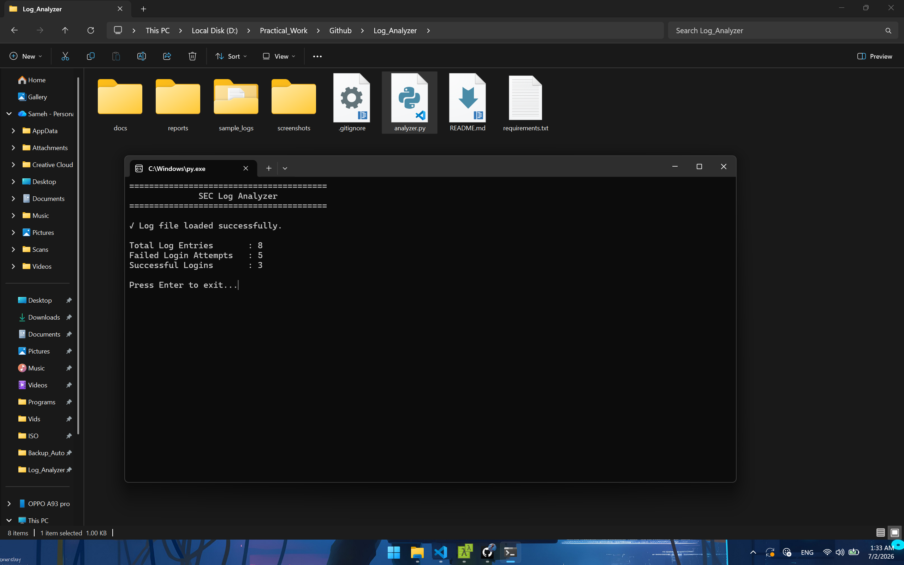

# SEC Log Analyzer 

A Python-based security tool that analyzes Linux authentication logs to detect failed login attempts, successful logins, and suspicious activities.

---

## Overview

SEC Log Analyzer is a lightweight log analysis tool designed to parse Linux authentication logs and provide useful and provide useful security insights. The project is built incrementally using an Agile sprint-based approach.

---

## Features

### Sprint 1
- Project initialization
- Professional project structure 
- Error handling for missing log files

### Sprint 2
- Load Linux authentication log files
- Count total log entries
- File validation and exception handling

### Sprint 3
- Detect failed login attempts
- Detect successful login attempts
- Display login statistics

---

## Screenshots


---

## Technologies

- Python
- File Handling
- String Processing 

---

## Project Structure

```text
Log_Analyzer/
│
├── analyzer.py
├── sample_logs/
│   └── auth.log
├── reports/
├── screenshots/
├── docs/
├── README.md
├── requirements.txt
└── .gitignore
```

## Current Status

🟢 Sprint 3 Completed

---

## Upcoming Features

- Extract usernames
- Extract IP Address
- Generate security reports
- Regex-based log parsing
- JSON report export
- Brute-force detection
