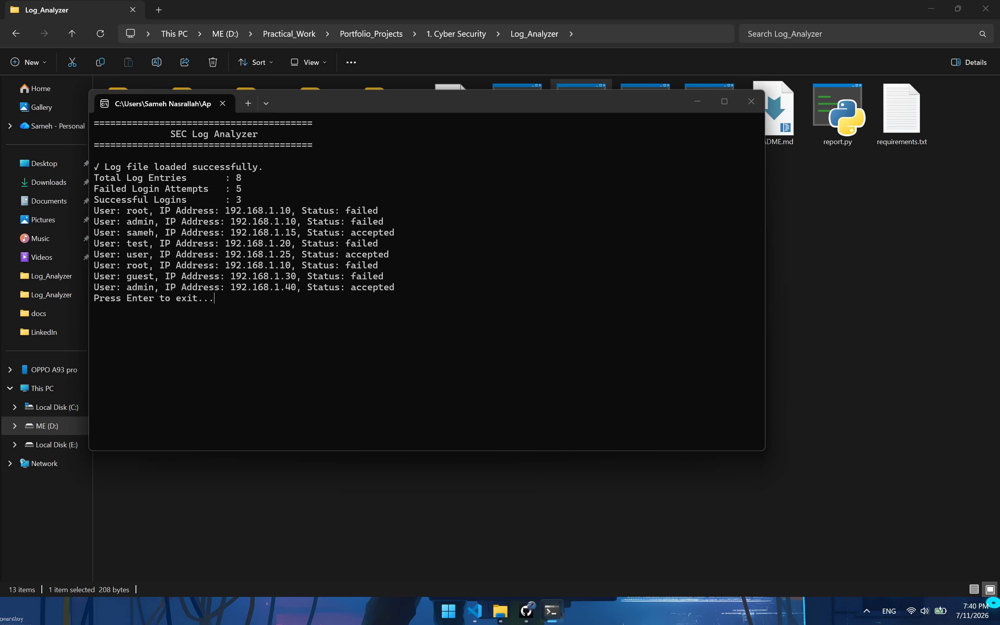

# SEC Log Analyzer 

A Python-based security tool that analyzes Linux authentication logs to detect failed login attempts, successful logins, and suspicious activities.

---

## Overview

SEC Log Analyzer is a lightweight log analysis tool designed to parse Linux authentication logs and provide useful and provide useful security insights. The project is built incrementally using an Agile sprint-based approach.

---

## Features

### Sprint 1
- Project initialization
- Professional project structure 
- Error handling for missing log files

### Sprint 2
- Load Linux authentication log files
- Count total log entries
- File validation and exception handling

### Sprint 3
- Detect failed login attempts
- Detect successful login attempts
- Display login statistics

### Sprint 4
- Detect failed login attempts
- Extract source IP addresses
- Regular Expression (Regex) based parsing
- Improved authentication event analysis

### Sprint 5
- Refactored the project into multiple modules
- Separated parsing, analysis, and reporting logic
- Improved project architecture 
- Introduced structured event data

### Sprint 6
- Introduced object-oriented design using Python dataclasses
- Replaced dictionaries with strongly typed models
- Added `LoginEvent` model
- Added `AnalysisResult` model
- Improved type safety across the project
- Enhanced code readability and maintainability

---

## Screenshots

### Sprint 6



---

## Technologies

- Python
- Regular Expressions (Regex)
- File Handling
- Exception Handling

---

## Project Structure

```text
Log_Analyzer/
│
├── analyzer.py
├── parser.py
├── main.py
├── report.py
├── models.py
├── sample_logs/
│   └── auth.log
├── reports/
├── screenshots/
├── docs/
├── README.md
├── requirements.txt
└── .gitignore
```

# 📌 Roadmap

### Upcoming (Sprint 7)

- Unit Testing
- Pytest 
- Test Coverage

---

## Current Status

📊 **v0.6.0**
🟢 Sprint 6 Completed

---

## Upcoming Features

- JSON report export
- HTML Reports
- Brute-force detection
- Suspicious IP Ranking
- Command-line Arguments
- Unit Testing